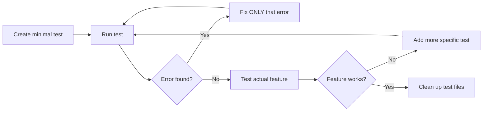

# Rapid Debugging Guide

## Quick Reference for Fast Issue Resolution

### The Golden Rule: Errors First, Solutions Second
**Never guess what's wrong - get the exact error message first!**

## 1. Minimal Test Creation Pattern

### JavaScript/Module Loading Issues
```javascript
// tests/check-app-load.spec.js
test('Check if app loads', async ({ page }) => {
    const errors = [];
    page.on('pageerror', e => errors.push(e.message));

    await page.goto('http://localhost:3000');

    if (errors.length > 0) {
        console.log('Errors:', errors);
    }

    const appExists = await page.evaluate(() => !!window.bitcoinApp);
    console.log('App loaded:', appExists);
});
```

### Routing/Navigation Issues
```javascript
// tests/debug-routing.spec.js
test('Check routing', async ({ page }) => {
    await page.goto('http://localhost:3000');
    const homePage = await page.locator('#homePage').isVisible();

    await page.goto('http://localhost:3000/#assets');
    await page.waitForTimeout(500);
    const assetsPage = await page.locator('#assetsPage').isVisible();

    console.log('Home visible:', homePage);
    console.log('Assets visible after nav:', assetsPage);
});
```

### DOM/UI Issues
```javascript
// tests/debug-ui.spec.js
test('Check UI elements', async ({ page }) => {
    await page.goto('http://localhost:3000');

    const elements = ['#homePage', '#mainNav', '#loginForm'];
    for (const selector of elements) {
        const exists = await page.locator(selector).count() > 0;
        const visible = exists ? await page.locator(selector).isVisible() : false;
        console.log(`${selector}: exists=${exists}, visible=${visible}`);
    }
});
```

## 2. Common Fixes Patterns

### Module Export/Import Issues
```bash
# Quick check for export issues
grep -n "export.*ClassName" file.js
grep -n "import.*{.*ClassName" file.js

# Batch fix missing exports
for file in src/**/*.js; do
    if grep -q "^export class" "$file" && ! grep -q "^export {" "$file"; then
        className=$(grep "^export class" "$file" | awk '{print $3}')
        echo "export { $className };" >> "$file"
    fi
done
```

### Finding Problem Files
```bash
# Find where something is imported
grep -r "import.*ComponentName" src/

# Find where something is defined
grep -r "class ComponentName" src/
grep -r "function ComponentName" src/
grep -r "const ComponentName" src/

# Check file structure
tail -20 src/path/to/file.js  # Check exports at end
head -20 src/path/to/file.js  # Check imports at start
```

## 3. The Debug Cycle



## 4. Time-Saving Commands

### Quick Test Runs
```bash
# Run single test file (fastest)
npx playwright test tests/debug.spec.js --reporter=list

# Run with specific timeout
npx playwright test tests/debug.spec.js --timeout=5000

# Run and see browser
npx playwright test tests/debug.spec.js --headed

# Clean up after debugging
rm tests/debug-*.spec.js
rm fix-*.sh
```

### Quick Debugging Scripts
```bash
#!/bin/bash
# debug-exports.sh - Check all exports
for file in src/**/*.js; do
    echo "=== $(basename $file) ==="
    tail -5 "$file" | grep -E "export"
done
```

## 5. Common Error → Solution Map

| Error Message | Likely Cause | Quick Fix |
|--------------|--------------|-----------|
| `Module does not provide export named 'X'` | Missing named export | Add `export { X }` to file |
| `X is not defined` | Missing import or global | Add import or check script load order |
| `Cannot read property of undefined` | Object not initialized | Check initialization order |
| `Duplicate export` | Multiple exports of same name | Remove duplicate export statement |
| `Module not found` | Wrong import path | Check file exists and path is correct |

## 6. Efficiency Tips

1. **Never run full test suite during debugging** - Use targeted tests
2. **Keep test files minimal** - Test only what's broken
3. **Fix one error at a time** - Each fix may reveal new errors
4. **Use `--reporter=list`** - Cleaner output for debugging
5. **Clean up after fixing** - Delete debug tests and logs
6. **Batch similar fixes** - Use scripts for repetitive changes
7. **Use grep before manual search** - It's always faster

## 7. When to Use Different Approaches

### Use Minimal Tests When:
- App won't load
- JavaScript errors on page load
- Module/import issues
- Routing completely broken

### Use Console Logging When:
- Need to trace execution flow
- Values are unexpected
- Timing issues suspected
- API calls failing

### Use Full Tests When:
- Basic functionality works
- Checking edge cases
- Validating complete user flows
- Before committing fixes

## Remember
**The fastest debugging is systematic debugging:**
1. Get the error
2. Fix the error
3. Get the next error
4. Repeat until working
5. Clean up
6. Done!

**Time spent creating a good minimal test saves hours of speculation!**